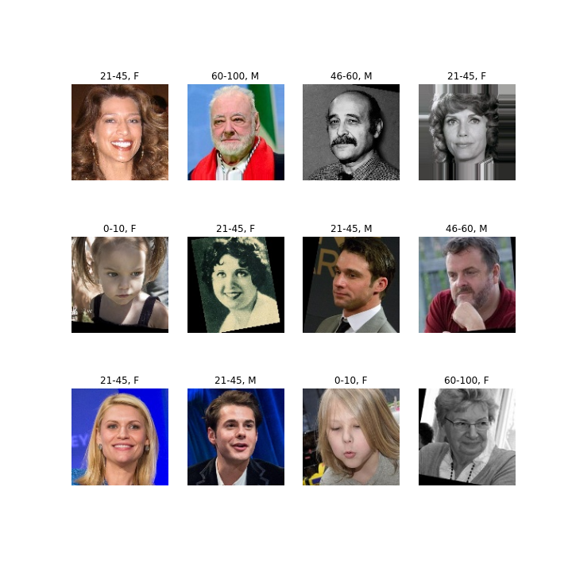
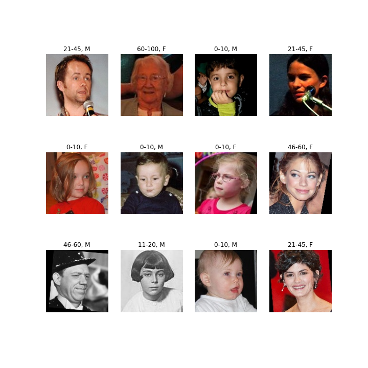

# Age and Gender Estimation



This is a fork of Keras implementation of a CNN for estimating age and gender from a face image.
While original code used [the IMDB-WIKI dataset](https://data.vision.ee.ethz.ch/cvl/rrothe/imdb-wiki/) dataset and ResNet backbone, this fork is specifically created to train smaller models, that are suitable for running on embedded devices with constrained resources while still achieving acceptable accuracy. 

The following changes have been made:
- ResNet backbone changed to choice of MobileNet v1 or MobileFaceNet
- Since for practical application, the exact age down to one year is not as important as general category, for age prediction, instead of using 100 classes for each discrete age year, the ages were grouped in five age groups: children(0-10), teenagers(11-20), adults(21-45), seniors(46-60) and older seniors(61-100).
- IMDB-WIKI, being extremely large and noisy dataset proved to be not suitable for training smaller models, thus it was changed to mixture of [UTKface](https://susanqq.github.io/UTKFace/) and [APPA-REAL](http://chalearnlap.cvc.uab.es/dataset/26/description/) datasets for training and APPA-REAL for validation and testing. 

Final accuracy of pre-trained MobileFaceNet model (alpha = 2.0, total params: 798,982, model size: 3.1 Mb Raspberry Pi 4 CPU inference time: ) is 92% for gender and 78% for age.


## Dependencies
- Python3.5+
- Tensorflow 2.4.1
- numpy, Pandas, tqdm
- dlib (for demo)
- OpenCV3

Tested on:
- Ubuntu 18.04, Python 3.9.4, Tensorflow 2.4.1, CUDA 10.1.243, cuDNN 7.6.5
- CPU: i5-6500 CPU@3.20GHz, GPU: GeForce GTX1080


## Usage

### Use pretrained model for demo
Run the demo script (requires web cam).
You can use `--image_dir [IMAGE_DIR]` option to use images in the `[IMAGE_DIR]` directory instead.

```sh
python3 tests/demo.py
```

The pretrained model for TensorFlow backend will be automatically downloaded to the `pretrained_models` directory.

### Download or create training data
First, download the dataset.
The dataset is downloaded and extracted to the `data` directory by:

```sh
./download.sh
```

The training data was created by create_db.py, which takes APPA-REAL and UTKFace (cropped with 40% margin, same as APPA-REAL) face images, resizes them, saves to corresponding folder and writes file names, ages and genders to .csv files. The dataset you download with `download.sh` is already pre-processed and ready to use.

### Train network
Train the network using the training data created above.

```sh
python train.py --train_csv data/processed_data/train.csv  --validation_csv data/processed_data/valid.csv --lr 1e-3 --alpha 2.0 --aug
```

Trained weight files are stored as `checkpoints/weights.*.hdf5` for each epoch if the validation loss becomes minimum over previous epochs.

```
usage: train.py [-h] --train_csv TRAIN_CSV --validation_csv VALIDATION_CSV
                [--batch_size BATCH_SIZE] [--nb_epochs NB_EPOCHS] [--lr LR] [--opt OPT]
                [--alpha ALPHA] [--bottleneck_weights BOTTLENECK_WEIGHTS]
                [--checkpoint CHECKPOINT] [--model_type MODEL_TYPE] [--aug]
                [--output_path OUTPUT_PATH]

This script trains the CNN model for age and gender estimation.

optional arguments:
  -h, --help            show this help message and exit
  --train_csv TRAIN_CSV
                        path to train database csv file (default: None)
  --validation_csv VALIDATION_CSV
                        path to validation database csv file (default: None)
  --batch_size BATCH_SIZE
                        batch size (default: 32)
  --nb_epochs NB_EPOCHS
                        number of epochs (default: 50)
  --lr LR               initial learning rate (default: 0.001)
  --opt OPT             optimizer name; 'sgd' or 'adam' (default: adam)
  --alpha ALPHA         alpha parameter for filter number (default: 0.5)
  --bottleneck_weights BOTTLENECK_WEIGHTS
                        bottleneck_weights (default: None)
  --checkpoint CHECKPOINT
                        checkpoint to continue training (default: None)
  --model_type MODEL_TYPE
                        MobileNet or MobileFaceNet (default: MobileFaceNet)
  --aug                 use data augmentation if set true (default: False)
  --output_path OUTPUT_PATH
                        checkpoint dir (default: checkpoints/datetime.now().strftime('%Y-%m-%d_%H-%M-%S'))

```

### Use the trained network

```sh
python3 tests/demo.py
```

```
usage: demo.py [-h] [--model_file MODEL_FILE] [--margin MARGIN] [--image_dir IMAGE_DIR]

This script detects faces from web cam input, and estimates age and gender for the detected faces.

optional arguments:
  -h, --help            show this help message and exit
  --model_file MODEL_FILE
                        path to weight file (e.g. weights.28-3.73.hdf5) (default: None)
  --margin MARGIN       margin around detected face for age-gender estimation (default: 0.4)
  --image_dir IMAGE_DIR
                        target image directory; if set, images in image_dir are used instead of
                        webcam (default: None)

```

Please use the best model among `checkpoints/weights.*.hdf5` for `MODEL_FILE` if you use your own trained models.

### Evaluation

#### Evaluation on the APPA-REAL dataset
You can evaluate a trained model on the APPA-REAL (validation) dataset by:

```b
usage: evaluate_appa_real.py [-h] [--model_file MODEL_FILE]

This script evaluate age estimation model using the APPA-REAL validation data.

optional arguments:
  -h, --help            show this help message and exit
  --model_file MODEL_FILE
                        path to weight file (e.g. weights.28-3.73.hdf5) (default: None)

```

Please refer to [here](http://chalearnlap.cvc.uab.es/dataset/26/description/) for the details of the APPA-REAL dataset.

The results of pretrained model is:

```
Accuracy age: 0.7831142568250758
Accuracy gender: 0.9282103134479271
```



## For further improvement
If you want better results, there would be several options:

- increase alpha parameter to see how large of the model you can get without overfitting
- when overfitting becomes a problem it would be sensible to use IMDB or Wiki datasets instead


## License
This project is released under the MIT license.
However, [UTKface](https://susanqq.github.io/UTKFace/) and [APPA-REAL](http://chalearnlap.cvc.uab.es/dataset/26/description/) datasets used in this project is originally provided under the following conditions.

> Please notice that this dataset is made available for academic research purpose only. All the images are collected from the Internet, and the copyright belongs to the original owners. If any of the images belongs to you and you would like it removed, please kindly inform us, we will remove it from our dataset immediately.

Therefore, the pretrained model(s) included in this repository is restricted by these conditions (available for academic research purpose only).


## References
[1] R. Rothe, R. Timofte, and L. V. Gool, "DEX: Deep EXpectation of apparent age from a single image," in Proc. of ICCV, 2015.

[2] R. Rothe, R. Timofte, and L. V. Gool, "Deep expectation of real and apparent age from a single image
without facial landmarks," in IJCV, 2016.

[3] H. Zhang, M. Cisse, Y. N. Dauphin, and D. Lopez-Paz, "mixup: Beyond Empirical Risk Minimization," in arXiv:1710.09412, 2017.

[4] Z. Zhong, L. Zheng, G. Kang, S. Li, and Y. Yang, "Random Erasing Data Augmentation," in arXiv:1708.04896, 2017.

[5] E. Agustsson, R. Timofte, S. Escalera, X. Baro, I. Guyon, and R. Rothe, "Apparent and real age estimation in still images with deep residual regressors on APPA-REAL database," in Proc. of FG, 2017.
